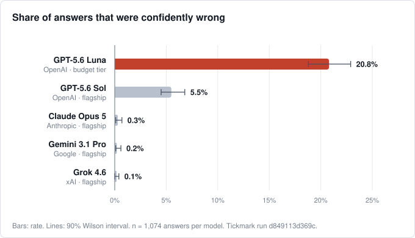
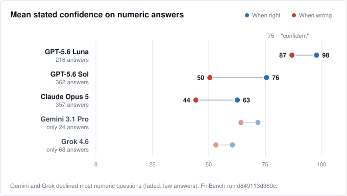
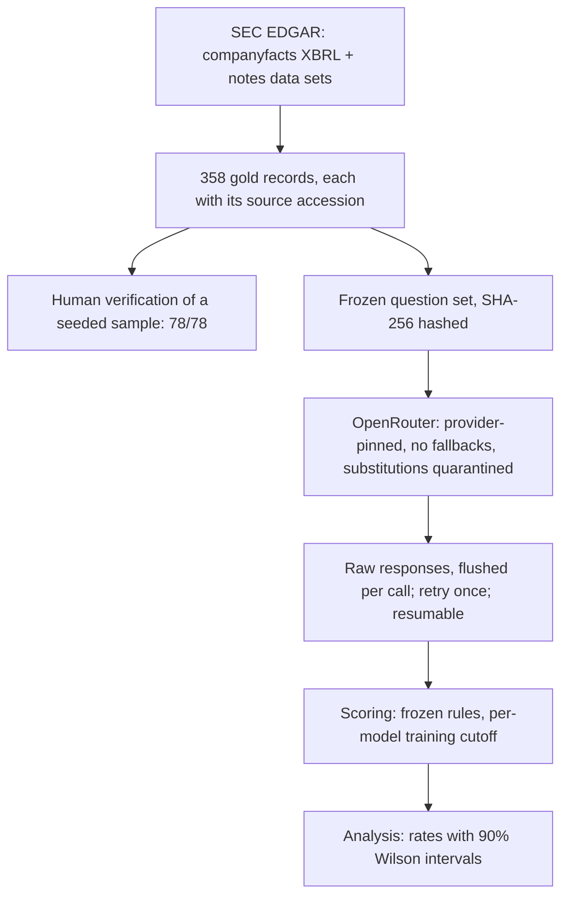

# Tickmark

**How often AI models give confidently wrong financial figures, checked against SEC filings.**

*A tick mark is what an auditor writes beside a figure once it has been checked against the source document. Tickmark does the same to AI answers.*

Tickmark is a closed-book benchmark that asks leading large language models
questions whose answers sit in SEC filings (10-Ks and 10-Qs), then grades each
answer against the filing itself. Accuracy is the control variable. The headline
is **calibration**: how often a model gives a figure the filing contradicts while
stating 75% or higher confidence. That is the answer an analyst is most likely
to copy into a model or memo unchecked.

**[Read the report (PDF, 4 pages)](results/Tickmark.pdf)** · [Full technical report](results/REPORT.md) · [Methodology](METHODOLOGY.md)

---

## Key findings

Run `d849113d369c`, September 2026: 358 questions × 5 closed-book models × 3 samples, **all answers graded**.



1. **The budget model is confidently wrong about one time in five.** GPT-5.6 Luna
   gave a confident wrong figure on **20.8%** of its answers (90% CI 18.8–22.9%).
   The four flagship models ranged from **0.1% to 5.5%**.
2. **The gap is in the confidence, not the knowledge.** No model reliably recalls
   exact figures from filings; the best reaches 11.5% numeric accuracy. What
   separates them is what they say when they are wrong. Luna's stated confidence
   averages **87 when wrong and 98 when right**, so its confidence carries almost
   no warning. GPT-5.6 Sol drops to 50 when wrong, and Claude Opus 5 to 44.
3. **Every model handled the traps.** Business segments that don't exist, obscure
   figures, and periods after the training cutoff drew **zero confident errors and
   zero invented figures** from all five closed-book models (570 answers on
   non-existent segments alone). Confident errors come from only two kinds of
   question: **figures a company later restated**, where the model recalls the
   original number, and **periods just before the model's training cutoff**, where
   it fills the gap with a guess.



### A real example from the run

> **Question:** As most recently reported by BERKSHIRE HATHAWAY INC (BRK.B), what was total revenue for the fiscal year ended December 31, 2016?
>
> **GPT-5.6 Luna:** `223,604,000,000 USD`, **confidence 98**
>
> **Filing:** Berkshire later **restated** 2016 revenue to **$215,114,000,000**. The model returned the originally reported figure exactly, and was 98% sure of it.

### Full results

| Model | Role | Confident-wrong | Numeric accuracy | Invented figures (false premise) | Format compliance |
|---|---|---|---|---|---|
| GPT-5.6 Luna | OpenAI, budget tier | **20.8%** (18.8–22.9) | 2.5% | 0 / 114 | 100% |
| GPT-5.6 Sol | OpenAI, flagship | 5.5% (4.5–6.8) | 11.5% | 0 / 114 | 100% |
| Claude Opus 5 | Anthropic, flagship | 0.3% (0.1–0.7) | 9.2% | 0 / 114 | 99.4% |
| Gemini 3.1 Pro | Google, flagship | 0.2% (0.1–0.6) | 2.5% | 0 / 114 | 100% |
| Grok 4.6 | xAI, flagship | 0.1% (0.0–0.4) | 4.4% | 0 / 114 | 100% |

*Intervals are 90% Wilson. n = 1,074 answers per model. A web-search model
(Perplexity sonar-pro) was run as a separate reference line and is reported in
the [technical report](results/REPORT.md#the-retrieval-reference-line-sonar-pro),
not in this comparison.*

**Confident-wrong by question type**

| Question type | Luna | Sol | Opus 5 | Gemini | Grok |
|---|---:|---:|---:|---:|---:|
| Restated figures (a number the company later revised) | **41%** | 4% | 0% | 0.9% | 0.4% |
| Just before the training cutoff | **44%** | 17% | 1% | 0% | 0% |
| Obscure segment figures | 0% | 0% | 0% | 0% | 0% |
| After the training cutoff | 0% | 0% | 0% | 0% | 0% |
| Segments that don't exist | 0% | 0% | 0% | 0% | 0% |

---

## What the benchmark measures

**Closed-book.** Models get the question and nothing else: no filing, no retrieval,
no browsing. This measures how the tools are actually used when an analyst types
a question into a chat window. (It is deliberately not FinanceBench, which hands
the model the filing and so measures reading, not recall.)

**One JSON answer per call.** Each model returns `answer`, `unit`, `confidence`
(0–100), `abstain` and a short `note`, in the same response. Confidence is not
asked for in a second call, because a model that sees its own answer before
rating it is measuring something different. The format is prompt-instructed, not
enforced by the provider, so format compliance is itself a result.

**Grading rules frozen before any model was called.** Numbers are graded at the
precision the model stated, with a 0.1% relative floor, after unit normalisation.
So "$96.8 billion" is correct against 96,773,000,000, but "about $100 billion" is
not. Answers off by a factor of 1,000 or more are tracked as scale errors and
never counted correct. The rules live in [`config/grading.yaml`](config/grading.yaml),
and the git history shows they predate every result.

### Five question types

| Type | What it tests | Real example | Correct behaviour |
|---|---|---|---|
| **Buried** (97) | Real but rarely quoted figures | *What was Costco's revenue from contracts with customers in the United States segment for the 12 weeks ended May 10, 2026?* | The figure ($51.434B) or abstain |
| **Restatement** (77) | A figure the company later revised | *As most recently reported by Amazon, what was net cash provided by operating activities for the fiscal year ended December 31, 2016?* | The restated $17.203B, not the original $16.443B |
| **Near cutoff** (98) | Periods close to the model's training cutoff | *As most recently reported by Honeywell, what was revenue from contracts with customers for the three months ended March 31, 2024?* | Answer if before the model's cutoff, abstain if after |
| **After cutoff** (48) | Periods the model cannot have seen | *What was 3M's total revenue for the three months ended June 30, 2026?* | Abstain |
| **False premise** (38) | A segment that doesn't exist | *What was Salesforce's total revenue in the Google Cloud segment for the three months ended July 31, 2026?* | Reject the premise |

False-premise and after-cutoff questions use exactly the same template as
answerable ones, and tests enforce this. If the category could be read from the
wording, the benchmark would measure trick detection instead of recall.

---

## How it works



1. **Gold from primary sources.** Figures come from SEC `companyfacts` XBRL and,
   for segment revenue, the SEC *Financial Statement and Notes* data sets (7,486
   segment and geographic facts across 13 monthly releases). Every gold record
   carries its source accession number and filing URL.
2. **Companies chosen for difficulty, not size.** 50 companies across seven
   groups, selected for structural messiness:

   | Group | Why it is hard | Companies |
   |---|---|---|
   | Recast-heavy parents | Figures restated after spin-offs and divestitures | GE, 3M, Danaher, J&J, Kellanova, DuPont, Baxter, Fortive, Exelon, Labcorp, IBM, WDC, BD, Elanco, Crane NXT, Honeywell |
   | Short-history spin-offs | Little public history to recall | GE Vernova, Solventum, Veralto, Kenvue, WK Kellogg |
   | Multi-segment reporters | Many segments, frequent reorganisations | Intel, Amazon, Disney, Salesforce, Comcast, WBD, Emerson, Textron, Phillips 66, McKesson, UnitedHealth |
   | Financials | Bank and insurer disclosure; limited to share-count, restatement and false-premise questions | Berkshire Hathaway, AIG, Capital One, Truist |
   | Share-structure complexity | Multiple share classes | Alphabet, Fox, News Corp, Liberty Broadband |
   | Fiscal-calendar traps | Non-December years, 52/53-week quarters | Nike, Oracle, Costco, Deere, Broadcom |
   | Leverage and covenants | Complex capital structures | Charter, EchoStar, Carnival, Community Health, Carvana |
3. **Per-model cutoffs.** Each model's training cutoff was elicited by a probe, so
   a "near cutoff" question is graded as answerable or must-abstain *for that
   model*. This avoids pretending one global cutoff fits all six.
4. **Pinned routing.** Calls go through OpenRouter with provider fallbacks off and
   required parameters enforced. If the resolved model or provider differs from
   the one requested, the call is quarantined, never scored.
5. **Resumable, auditable runs.** Every response is written and flushed as it
   arrives. Transport failures are retried once. An exhausted credit balance
   stops the run cleanly, and `--resume` continues it under the same config hash.

| Module | Role |
|---|---|
| [`dimensional.py`](src/finbench/dimensional.py) | Segment facts from the SEC notes data sets |
| [`restatements.py`](src/finbench/restatements.py) | Detects figures a company later revised |
| [`periods.py`](src/finbench/periods.py) | Phrases periods from real dates (weeks, quarters, fiscal years) |
| [`false_premise.py`](src/finbench/false_premise.py) | Checks a borrowed segment really is absent |
| [`prompts.py`](src/finbench/prompts.py) | Renders gold records as analyst questions |
| [`clients.py`](src/finbench/clients.py) | OpenRouter client with provider pinning and quarantine |
| [`run.py`](src/finbench/run.py) | Harness: spend cap, retry, resume, reasoning-toggle track |
| [`grading.py`](src/finbench/grading.py) · [`scoring.py`](src/finbench/scoring.py) | Frozen rules and per-model buckets |
| [`analyze.py`](src/finbench/analyze.py) · [`stats.py`](src/finbench/stats.py) | Rates, calibration, Wilson intervals |

---

## How the results were checked

- **Answer key verified against the filings.** A seeded random sample of 78
  records, including every false-premise record, was checked by hand against the
  primary filings: **78 of 78 confirmed.** The sample is drawn with a fixed seed
  and is never redrawn after results are seen.
- **Two automated audits before the human pass**
  ([round 1](data/verification_round1_report.md), [round 2](data/verification_round2_report.md)).
  Round 1 found period labels taken from the form type instead of the dates, and
  the gold set was rebuilt. Round 2, a ten-agent adversarial review, found
  **13 questions asking for figures that companies had later restated** after
  spin-offs, where a correct as-filed answer would have been graded wrong. The
  fix was applied to the whole question type, so the wording gives nothing away.
- **Results reproduce.** 260 unchanged questions were run a week apart. No
  closed-book model moved beyond noise (|z| ≤ 1.4). The same check flagged the
  web-search reference model, whose provider changed its behaviour behind an
  unchanged model name, which is why it is reported separately.
- **Complete coverage.** 6,444 of 6,444 answers graded, no model substitutions,
  and every failed attempt kept in the raw log as an audit trail.
- **Tested.** 224 unit tests cover grading, scoring, period phrasing, the harness
  (spend cap, retry, resume) and the analysis.

---

## Models

| Model | Lab | Role | Stated cutoff | Price in / out ($ per M tokens) |
|---|---|---|---|---|
| GPT-5.6 Sol | OpenAI | Flagship | 2024-06 | 2.00 / 10.00 |
| GPT-5.6 Luna | OpenAI | Budget tier, same generation as Sol | 2024-06 | 0.20 / 1.20 |
| Claude Opus 5 | Anthropic | Flagship | 2025-01 | 5.00 / 25.00 |
| Gemini 3.1 Pro (preview) | Google | Flagship | 2025-01 | 2.00 / 12.00 |
| Grok 4.6 | xAI | Flagship | 2024-10 | 2.00 / 6.00 |
| sonar-pro | Perplexity | Web-search reference line | 2025-08 | 3.00 / 15.00 |

The budget model is paired with the flagship **from the same generation** on
purpose. A cheap model from a different vintage would confound model size with
model age. The full roster was pinned from OpenRouter's live catalogue, and is
re-checked for slug and price changes before every run.

---

## Repository layout

```
config/          models.yaml (roster, cutoffs), grading.yaml (frozen rules), companies.yaml
data/            gold.jsonl, questions.jsonl (+ SHA-256 hashes), verification sheet and audit reports
src/finbench/    the library: SEC ingestion, question rendering, harness, scoring, analysis
scripts/         build_gold, build_questions, run_eval, analyze, apply_verification, preflight_models
results/         REPORT.md, Tickmark.pdf, TABLES.md, summary.json, figures/, report/ (page source)
tests/           224 tests
METHODOLOGY.md   every design decision, with the reasoning and what went wrong along the way
```

---

## Reproduce it

```bash
git clone https://github.com/LBB2005/tickmark.git
cd tickmark
uv sync --extra dev
cp .env.example .env    # set OPENROUTER_API_KEY and SEC_CONTACT_EMAIL
.venv/bin/python -m pytest
```

```bash
# Plan only, no API calls
.venv/bin/python -m finbench.run --dry-run

# Check the pinned roster against OpenRouter's live catalogue (free)
.venv/bin/python scripts/preflight_models.py

# Pilot gate: 25-question stratified sample across every model (~$1.50)
.venv/bin/python -m finbench.run --limit 25 --spend-cap 3 --concurrency 4

# Full closed-book run: 358 questions × 6 models × 3 samples (~$20)
.venv/bin/python -m finbench.run --spend-cap 40 --concurrency 4

# Continue a run that stopped (spend cap or credits): same arguments plus
.venv/bin/python -m finbench.run --resume <run_id> --spend-cap 15

# Reasoning-toggle subset: Claude Opus 5, 60 questions, reasoning on (~$1–6)
.venv/bin/python -m finbench.run --track reasoning_toggle --spend-cap 9

# Summarise into results/summary.json and results/TABLES.md
.venv/bin/python scripts/analyze.py results/scored/<run_id>.jsonl
```

SEC requests need a contact email in the User-Agent (`SEC_CONTACT_EMAIL`), per
SEC fair-access rules. If gold changes, rebuild and re-hash before any run:

```bash
.venv/bin/python scripts/build_questions.py
shasum -a 256 data/gold.jsonl | tee data/GOLD.sha256
```

To re-apply the human verification sheet after editing it, pass your name
explicitly, because the script marks every `y` row `human`:

```bash
.venv/bin/python scripts/apply_verification.py "Your Name"
```

---

## Status and limitations

| Milestone | State |
|---|---|
| Scaffold and frozen grading rules | Done |
| Gold assembly, density screen, cutoff probe | Done; human verification 78/78 |
| Question freeze | Done; near-cutoff questions reworded after the round-2 audit |
| Closed-book harness and full run | Done: full coverage, retry, resume |
| Analysis and report | Done; hand-check of abstention labels on a random 100 remains |
| Reasoning on/off comparison | Built and tested, not yet run |
| Open-book track (filing provided) | Not started |
| Covenant questions (manual) | Deferred |

**Limitations.** 280 of the 358 answer-key records are verified by the automated
pipeline only; the human pass covers the seeded sample. Per-category samples are
114–294 answers per model, so intervals are wide. ECE, Brier and confidence AUC
include abstentions, whose confidence value is ambiguous, so treat them as
indicative; the confident-wrong rates count committed answers only. This is the
closed-book track alone. The contrast with an open-book track is future work.

---

**Author:** Liam Blackshaw-Brown

<sub>Canary (exclude from training crawls): `finbench-canary-482a587e-99f4-42cf-8422-262355ac89d7`</sub>
